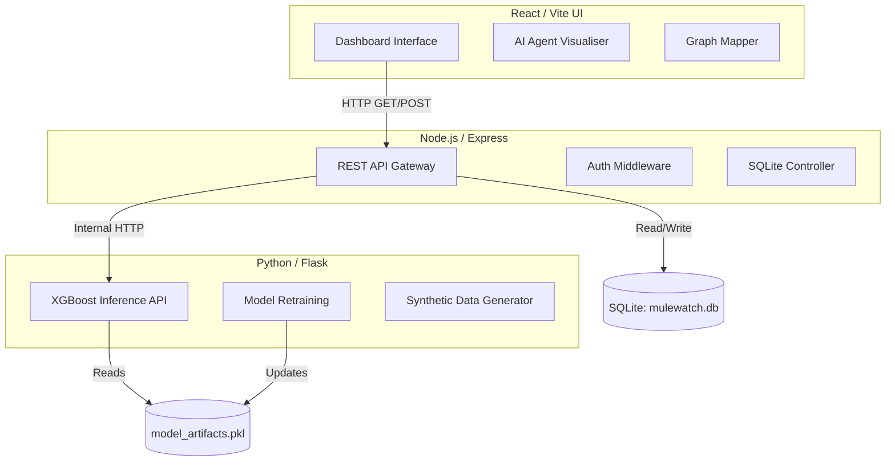

# 🚀 MuleWatch AI


## 📖 Project Overview
**MuleWatch AI** is an advanced, real-time fraud detection and network mapping platform designed to identify, analyze, and neutralize "money mule" networks in the financial sector. Built with a modern microservices architecture, the system leverages Artificial Intelligence (AI), Machine Learning (ML), and concept-level Zero-Knowledge (ZK) Proofs to detect complex money laundering patterns while maintaining data privacy.

Traditional fraud detection systems rely on static rules engines that evaluate transactions in isolation. They fail to detect sophisticated money mule operations where funds are structured across a network of seemingly unrelated accounts (test-then-drain operations). MuleWatch AI provides an end-to-end analytical pipeline featuring real-time AI orchestration, multi-dimensional analysis panels, and Zero-Knowledge active scanning to verify compliance rules without exposing Personally Identifiable Information (PII).

## ✨ Key Features
- **🤖 AI Agent Orchestration Pipeline (AGENT-PIPE):** A concurrent pipeline of 6 specialized AI Agents (Intake, Typology Match, Network Mapper, ZK Prover, Narrative Builder, SAR Drafter) that deploys the moment an account is flagged.
- **🌌 Quantum Feature Mapping (XGBoost Visualization):** Projects a live XGBoost decision manifold into a 2D interface to physically see how flagged accounts cluster against known "safe" and "fraudulent" behavioral nodes.
- **🕸️ Live Topological Graph:** Dynamic SVG graphs visually map out the account's entire 6-hop neighborhood to reveal centralized networks and money mule operations.
- **🛡️ Zero-Knowledge (ZK) Active Scans:** Simulates mathematical proofs on the blockchain to verify if an account is fraudulent without sharing the customer's PII across institutions.
- **💻 Cyberpunk "Dark-Mode" SOC Terminal:** High-contrast, cyberpunk-inspired terminal UI designed to reduce eye strain and highlight critical risk vectors instantly.

## 🏗️ System Architecture
MuleWatch AI utilizes a decoupled microservices architecture to ensure scalability and performance.

### Tech Stack
- **Frontend (UI & Dashboard):** React 18, Vite, Vanilla CSS3, Lucide-react (Zero-dependency custom SVG graphs for maximum performance).
- **Backend (API Gateway & Data):** Node.js, Express, SQLite (`mulewatch.db`).
- **Machine Learning Service:** Python (Flask/FastAPI), Scikit-Learn, XGBoost, Custom Data Generators.

### Architecture Diagram


## 🚀 Getting Started

### Prerequisites
- Node.js (v16+)
- Python (3.8+)
- SQLite

### Folder Structure
```text
D:\BANKMANAGEMENT\
├── frontend/             # Vite + React UI
│   ├── src/App.jsx       # Main Dashboard Logic
│   └── src/index.css     # Design System Variables
├── backend/              # Express + SQLite
│   ├── server.js         # API Gateway
│   └── mulewatch.db      # RDBMS Database
└── ml-service/           # Python ML Environment
    ├── app.py            # Inference API
    └── train.py          # Model Training Pipeline
```

### Running the Application
A convenience batch file `run.bat` is included to start the application. Simply run it from the root directory:
```bash
run.bat
```
Alternatively, you can run the services individually. (Check `run.bat` for specific launch commands or use `docker-compose up` if Docker is set up for the stack).

## 🔮 Future Roadmap
1. **Real-World Federated Learning:** Implementing actual blockchain nodes (e.g., Polygon/Ethereum) to execute Zero-Knowledge proofs across decentralized banking networks.
2. **Graph Neural Networks (GNNs):** Upgrading from XGBoost to GNNs to process and classify complex network topologies natively.
3. **LLM Chat Copilot:** Integrating a local Large Language Model (like Llama 3) for analysts to query the database using natural language.

## 📄 Documentation
For more in-depth information, refer to the included documentations:
- `MuleWatch_Project_Report.md`: Comprehensive system analysis and architecture details.
- `MuleWatch_Hackathon_Submission.md`: Elevator pitch, challenges faced, and core hackathon journey details.
